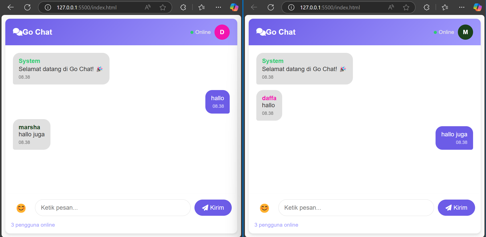

## 📋 Informasi Mahasiswa

| Nama               | NIM        | Mata Kuliah           | Keterangan               |
|--------------------|------------|-----------------------|---------------------------|
| Daffa Sadewa Putra | 312310463  | Pemrograman Web 2     | UTS Pemrograman Web 2     |

# Go Chat - Hasil Eksperimen WebSocket 🚀

**Go Chat** adalah hasil **eksperimen** dalam membangun aplikasi **chat real-time** menggunakan **WebSocket**.  
Eksperimen ini dilakukan untuk memahami konsep komunikasi dua arah secara real-time antara client dan server menggunakan Node.js dan WebSocket.

## 🎯 Tujuan Eksperimen

- Mempelajari dasar penggunaan WebSocket dalam aplikasi web.
- Membangun server WebSocket sederhana menggunakan Node.js.
- Membuat aplikasi chat interaktif yang dapat menangani banyak pengguna secara real-time.

## 📚 Deskripsi Project

Aplikasi ini memungkinkan banyak pengguna untuk:

- Bergabung ke ruang obrolan.
- Mengirim pesan secara real-time.
- Melihat siapa saja yang sedang online.
- Menggunakan emoji dalam percakapan.

Semua komunikasi dilakukan melalui WebSocket tanpa perlu reload halaman.

## 🛠️ Teknologi yang Digunakan

- **Frontend**: HTML5, CSS3, Vanilla JavaScript
- **Backend**: Node.js + `ws` (WebSocket library)
- **Library Tambahan**: Font Awesome untuk ikon

## 🚀 Cara Menjalankan

Clone repository ini:

```bash
git clone https://github.com/username/go-chat.git
cd go-chat
```

Install dependency:

```bash
npm install ws
```

Jalankan server:

```bash
node server.js
```

Buka file `index.html` di browser.

> Pastikan server berjalan di `ws://localhost:8080` sebelum membuka aplikasi.

## ✨ Fitur

- Chat real-time antar banyak pengguna.
- Notifikasi pengguna bergabung dan keluar.
- Menampilkan jumlah pengguna online secara dinamis.
- Panel emoji untuk memperkaya pesan.
- Reconnect otomatis saat koneksi WebSocket terputus.

## 📖 Hasil Eksperimen



- WebSocket memungkinkan komunikasi dua arah tanpa perlu melakukan polling.
- Event `onopen`, `onmessage`, dan `onclose` digunakan untuk mengelola komunikasi real-time.
- Server menggunakan struktur `Map` untuk mengelola identitas pengguna yang terhubung.

## 📜 Catatan

- Server WebSocket berjalan pada port 8080.
- Aplikasi ini tidak menggunakan database, semua data pengguna hanya disimpan sementara di server.

## 📋 Lisensi

Project ini dibuat untuk keperluan **eksperimen** dan **pembelajaran**. Bebas digunakan dan dimodifikasi.


